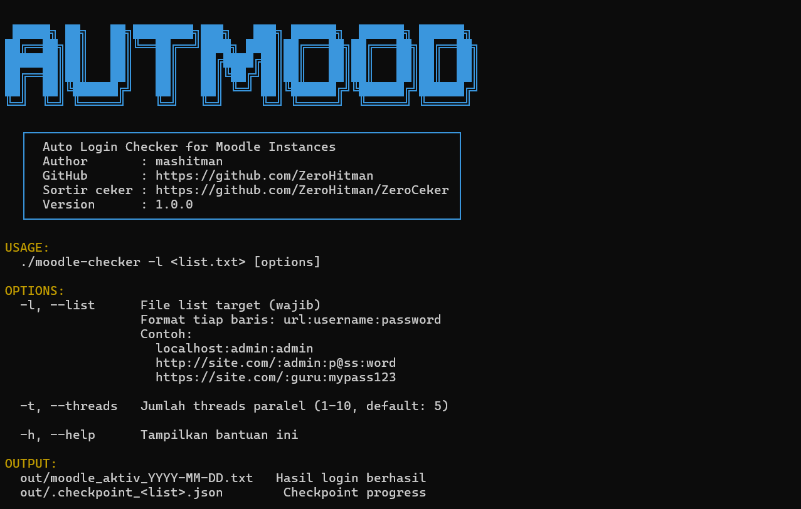

🔥 AUTMood — Moodle Auto Login Tool
===================================

⚡ AUTMood is a precompiled Moodle auto login tool designed for testing
multiple Moodle credentials efficiently.

🔒 Binary only release — source code is private.

--------------------------------------------------
📸 PREVIEW / SCREENSHOTS
--------------------------------------------------



--------------------------------------------------
✨ FEATURES
--------------------------------------------------

🚀 Auto login to Moodle instances  
🔄 Smart retry system for login validation  
🧠 Moodle role detection:
   🔥 administrator
   👨‍🏫 teacher

📊 Progress indicator during execution  
⏸️ CTRL + C support (pause/stop execution)  
💾 Save successful logins to local file  
🎯 Clean output (no failed login spam)

--------------------------------------------------
🧰 REQUIREMENTS
--------------------------------------------------

✅ Linux / macOS / Windows  
❌ No Go installation required  
❌ No dependencies required for users  

👉 Just download the binary and run.
--------------------------------------------------
🚀 USAGE
--------------------------------------------------

1) Download binary

Using wget:
```
wget https://raw.githubusercontent.com/ZeroHitman/ZeroHitAUTMood/main/AUTMood
```
Using curl:
```
curl -LO https://raw.githubusercontent.com/ZeroHitman/ZeroHitAUTMood/main/AUTMood
```

2) Give execute permission (Linux / macOS)
```
chmod +x AUTMood
```

3) Run the tool

Auto mode (recommended):
```
./AUTMood -l test.txt -t 10
```

Notes:
- Make sure the binary name matches your system
- For large lists, be patient and avoid interrupting too often
- Use CTRL + C to pause (resume or stop safely)

--------------------------------------------------
⚙️ OPTIONS
--------------------------------------------------
```
USAGE:
  ./moodle-checker -l <list.txt> [options]

OPTIONS:
  -l, --list      File list target (wajib)
                  Format tiap baris: url:username:password
                  Contoh:
                    localhost:admin:admin
                    http://site.com/:admin:p@ss:word
                    https://site.com/:guru:mypass123

  -t, --threads   Jumlah threads paralel (1-10, default: 5)

  -h, --help      Tampilkan bantuan ini

OUTPUT:
  out/moodle_aktiv_YYYY-MM-DD.txt   Hasil login berhasil
  out/.checkpoint_<list>.json        Checkpoint progress
```

--------------------------------------------------
📄 TARGET LIST FORMAT
--------------------------------------------------

Format:
```
url:username:password
```
Examples:
```
localhost/lms/:iknow:1234567
http://localhost/moodle-web/:iknow1:1234567
localhost/moodle-web/:iknow2:1234567
https://localhost/:iknow3:1234567
http://localhost/moodle-web/:iknow4:1234567
```
✔ http:// is optional  
✔ Custom MOODLE paths supported  
✔ Special characters in passwords supported  


--------------------------------------------------
📤 OUTPUT
--------------------------------------------------

🖥️ Terminal:
- Real-time progress bar
- Colored [SUCCESS] output by role
- No failed login output

📁 Local file (success.txt):
```
═══════════════════════════════════════════════════
 HASIL SCAN — Berhasil: 2 dari 2 target
═══════════════════════════════════════════════════
http://localhost/moodle-web//login/index.php|teacher|Teacher1@#$; | role=teacher
http://localhost/moodle-web//login/index.php|admin|ADMIN1@#$; | role=administrator moodle
═══════════════════════════════════════════════════
 Output disimpan : out/moodle_aktiv_2026-04-26.txt
═══════════════════════════════════════════════════
```

--------------------------------------------------
⏸️ PAUSE / RESUME
--------------------------------------------------

Press CTRL + C during execution:

▶ y : resume process  
⛔ n : stop process safely  

✔ Already saved results will NOT be lost.


--------------------------------------------------
⚠️ SECURITY NOTICE
--------------------------------------------------

🔒 Binary only repository  
🚫 Source code is not included  
🛑 Reverse engineering is discouraged  

This tool is intended for:
✔ Educational purposes  
✔ Authorized testing  
✔ Personal research  

❗ Do NOT use this tool on systems you do not own
or do not have permission to test.


--------------------------------------------------
👤 AUTHOR
--------------------------------------------------

mashitman  
GitHub: https://github.com/ZeroHitman


--------------------------------------------------
⭐ SUPPORT
--------------------------------------------------

If you find this tool useful:
⭐ Star the repository  
📢 Share responsibly  

🔥 Build smart. Test responsibly.
